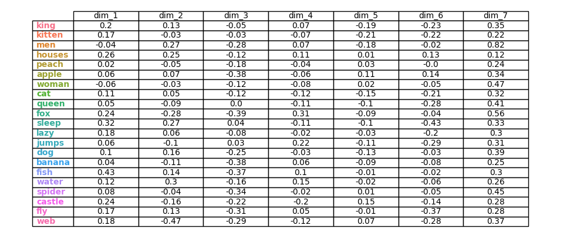
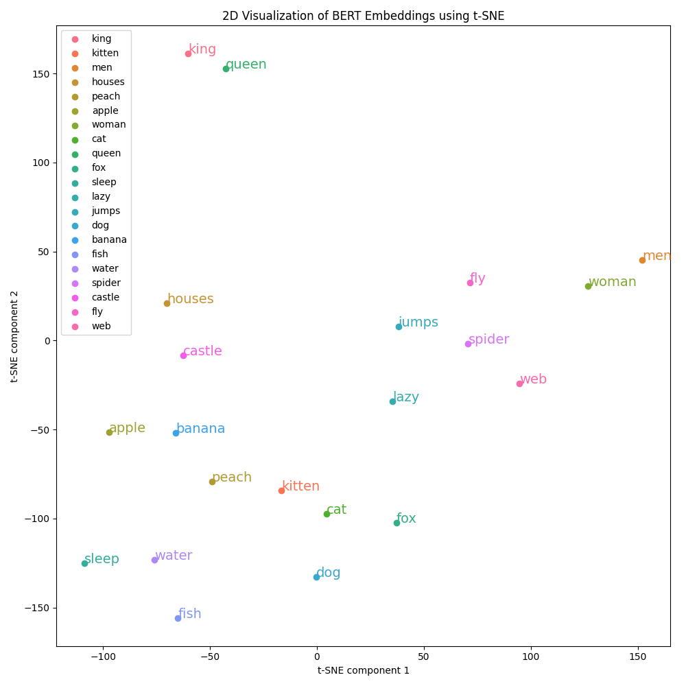
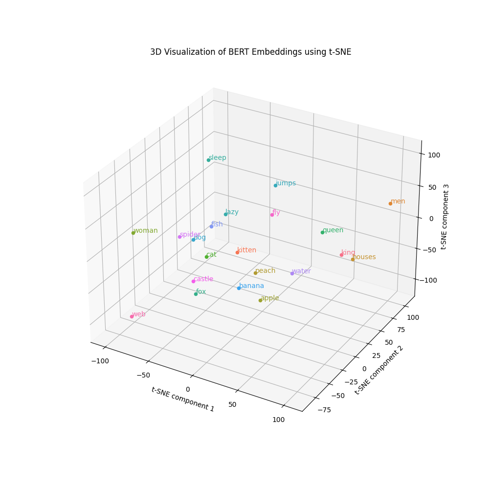

# Embedding Visualization with t-SNE

This project visualizes BERT embeddings using t-SNE for dimensionality reduction. It supports both 2D and 3D visualizations and can save plots and animations.

## Features

- Tokenize words and extract BERT embeddings
- Use t-SNE for 2D and 3D dimensionality reduction
- Plot and annotate 2D and 3D visualizations
- Save plots and animations
- Display part of the embeddings in a table format

## Requirements

tested with Python 3.11
- Required libraries (can be installed via `requirements.txt`):
  - argparse
  - numpy
  - matplotlib
  - seaborn
  - scikit-learn
  - transformers
  - torch

## Installation

1. Clone the repository:

   ```bash
   git clone https://github.com/dkruyt/embedding-viz.git
   cd embedding-viz
   ```

2. Install the required libraries:

   ```bash
   pip install -r requirements.txt
   ```

## Usage

You can use the script in two ways: through a Jupyter notebook or as a command-line interface (CLI).

### Jupyter Notebook

Open `embedding-viz.ipynb` in Jupyter Notebook and follow the instructions to visualize embeddings interactively.

### Command-Line Interface (CLI)

Run the `embedding-viz.py` script with the following options:

- `--list`: List of words to visualize (default is a predefined list)
- `--save`: Directory to save the plots and table (optional)
- `--ani`: Show the 3D animation (optional)

Example:

```bash
python embedding-viz.py --list king queen cat dog --save output --ani
```

This command will visualize the embeddings for "king", "queen", "cat", and "dog", save the plots in the `output` directory, and show the 3D animation.

## Output

The script generates the following files in the specified output directory:

- `tsne_2d.png`: 2D t-SNE plot of the embeddings
- `embedding_table.png`: Table showing part of the embeddings
- `tsne_3d.png`: 3D t-SNE plot of the embeddings
- `rotation_animation.mp4`: 3D animation of the embeddings (if `--ani` is used)

#### Embedding Table


#### 2D t-SNE Plot


#### 3D t-SNE Plot


#### Rotation Animation
https://github.com/dkruyt/embedding-viz/assets/713812/ed71838f-a09b-4340-b4a8-899a9ec8b8ec


## Example

Here is an example of how to use the script and what the output might look like:

```bash
python embedding-viz.py --list king queen cat dog --save output --ani
```

This will generate:

- A 2D t-SNE plot of the words "king", "queen", "cat", and "dog"
- A table showing part of their embeddings
- A 3D t-SNE plot
- An animated rotation of the 3D plot saved as an MP4 file

## Contributing

Feel free to contribute to this project by submitting issues or pull requests. Your contributions are welcome!

## License

This project is licensed under the MIT License. See the LICENSE file for details.

---

If you have any questions or need further assistance, please open an issue on the GitHub repository. Happy embedding visualization!
